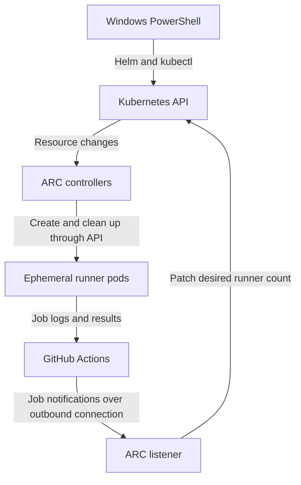

# GitHub Actions runners on Amazon EKS

Deploy Actions Runner Controller (ARC) from Windows PowerShell, run ten GitHub Actions jobs on temporary Linux pods, and return to zero runner pods when the jobs finish.

This guide uses an existing EKS cluster. It includes the configuration files, a manually triggered test workflow, and the troubleshooting steps used during this integration.

> **Current progress:** chart version `0.14.2` was installed and the listener was reported available after correcting the repository URL. The ten-runner test is supplied below; its successful completion has not yet been recorded. This is a lab configuration, not a production certification.

## Contents

- [Architecture and scaling](#architecture-and-scaling)
- [Files and settings](#files-and-settings)
- [1. Prepare Windows tools](#1-prepare-windows-tools)
- [2. Authenticate and connect to EKS](#2-authenticate-and-connect-to-eks)
- [3. Create namespaces and install the controller](#3-create-namespaces-and-install-the-controller)
- [4. Configure GitHub authentication](#4-configure-github-authentication)
- [5. Install or update the runner scale set](#5-install-or-update-the-runner-scale-set)
- [6. Run the ten-pod test](#6-run-the-ten-pod-test)
- [7. Verify scale-down](#7-verify-scale-down)
- [Troubleshooting](#troubleshooting)
- [Production considerations](#production-considerations)
- [Optional cleanup](#optional-cleanup)
- [Official references](#official-references)

## Architecture and scaling

You run `aws`, `kubectl` and `helm` on Windows. The controller, listener and runner containers execute inside EKS. Shell commands inside the supplied workflow run in Linux Bash.



The listener initiates an outbound HTTPS connection to GitHub. When jobs become available, it updates `EphemeralRunnerSet.spec.replicas` through the Kubernetes API. ARC controllers reconcile the runner resources and Kubernetes schedules their pods. Each ephemeral runner handles one job and is cleaned up afterwards. See the [ARC architecture documentation](https://docs.github.com/en/actions/concepts/runners/actions-runner-controller).

| Component | Responsibility | Remains when idle? |
|---|---|---|
| ARC controller | Manages ARC resources and runner lifecycle | Yes |
| Listener | Receives GitHub job notifications and requests capacity | Yes |
| Runner pod | Executes one GitHub job | No, with minimum zero |
| EKS worker node | Supplies CPU, memory and pod capacity | Managed separately |

This setup does not require an HPA. It uses job demand, rather than CPU or memory, to determine runner capacity. A simplified target is:

```text
Desired runners = min(maxRunners, assigned jobs + minRunners)
```

For this lab, `minRunners: 0` and `maxRunners: 10`. These configured limits stay unchanged as demand varies. The desired replica count changes inside ARC's custom resources; it is not a user-managed Kubernetes ReplicaSet. See [runner limits](https://docs.github.com/en/actions/how-tos/manage-runners/use-actions-runner-controller/deploy-runner-scale-sets#setting-the-maximum-and-minimum-number-of-runners).

## Files and settings

| File | Purpose |
|---|---|
| [k8s/arc/namespaces.yaml](k8s/arc/namespaces.yaml) | Creates controller and runner namespaces |
| [k8s/arc/runner-values.yaml](k8s/arc/runner-values.yaml) | Helm values for the repository and runner capacity |
| [scripts/New-ArcGitHubSecret.ps1](scripts/New-ArcGitHubSecret.ps1) | Prompts for a token and creates the Secret |
| [.github/workflows/arc-scale-test.yml](.github/workflows/arc-scale-test.yml) | Creates ten parallel shell jobs |
| [UPLOAD-GUIDE.md](UPLOAD-GUIDE.md) | Adds these files to an existing GitHub repository |

| Setting | Lab value |
|---|---|
| Repository URL | `https://github.com/meshekar51/go-web-app-devops` |
| Controller release / namespace | `arc` / `arc-systems` |
| Runner release / namespace | `k8s-runners` / `arc-runners` |
| GitHub Secret | `github-auth`, key `github_token` |
| Both Helm chart versions | `0.14.2`, observed in this integration |
| Runner image | `ghcr.io/actions/actions-runner:latest` for this lab |
| Runner range | 0 idle, 10 maximum total |

**Prerequisites:** a working EKS cluster with Linux workers; permission to manage ARC's CRDs and RBAC; a repository you administer; and network connectivity. Your Windows machine must reach the EKS API and chart registry. EKS nodes must pull container images, and ARC pods must reach GitHub's required endpoints. Private EKS endpoints need an approved path from your laptop, such as a VPN. Private worker subnets normally need NAT or an approved proxy for internet destinations.

No ALB or Ingress is needed for job delivery. For restricted egress, use GitHub's full [self-hosted runner communication requirements](https://docs.github.com/en/actions/reference/runners/self-hosted-runners#communication-requirements); allowing only `github.com` is insufficient.

## 1. Prepare Windows tools

Open Windows PowerShell or a PowerShell tab in Windows Terminal. Start in the extracted bundle root, or your repository root after copying the files. All relative paths below are based on that root.

```powershell
Get-Location
Test-Path .\k8s\arc\runner-values.yaml
aws --version
kubectl version --client
helm version --short
```

`Test-Path` should return `True`. Skip installation for tools already present. For missing tools:

```powershell
winget install --exact --id Amazon.AWSCLI
winget install --exact --id Kubernetes.kubectl
winget show --exact --id Helm.Helm --versions
```

Select an available Helm 3 version from the list, matching the [ARC quickstart prerequisites](https://docs.github.com/en/actions/tutorials/use-actions-runner-controller/get-started):

```powershell
$HelmVersion = Read-Host 'Enter an available Helm 3 version'
if ($HelmVersion -notmatch '^3\.\d+\.\d+$') {
    throw 'Choose a Helm 3 version from the list.'
}
winget install --exact --id Helm.Helm --version $HelmVersion
```

Reopen PowerShell after installation so PATH changes are loaded, return to the bundle/repository root, and repeat the checks. See the official [Windows kubectl guide](https://kubernetes.io/docs/tasks/tools/install-kubectl-windows/) and [Helm installation guide](https://v3.helm.sh/docs/intro/install/).

Run subsequent sections in the same terminal. Variables are lost when that terminal closes.

## 2. Authenticate and connect to EKS

First check your AWS identity:

```powershell
aws sts get-caller-identity
```

If this shows the intended account and identity, keep your existing authentication. Otherwise, for company SSO:

```powershell
aws configure sso --profile arc-lab
aws sso login --profile arc-lab
$env:AWS_PROFILE = 'arc-lab'
aws sts get-caller-identity
```

Supply your organisation's SSO details. If your personal lab instead uses approved IAM access keys, use `aws configure --profile arc-lab`, then set the same `AWS_PROFILE` variable. See [AWS CLI SSO configuration](https://docs.aws.amazon.com/cli/latest/userguide/cli-configure-sso.html).

Set your actual cluster name and region:

```powershell
$ArcRegion = 'ap-southeast-2'
$ArcCluster = Read-Host 'Enter your existing EKS cluster name'
aws eks describe-cluster --region $ArcRegion --name $ArcCluster --query 'cluster.{Name:name,Status:status,Version:version}' --output table
aws eks update-kubeconfig --region $ArcRegion --name $ArcCluster
kubectl config current-context
kubectl get nodes -L kubernetes.io/os
kubectl get pods -n kube-system
```

Confirm the intended context, ready Linux nodes and healthy system pods before proceeding. `update-kubeconfig` supplies connection settings; it does not grant Kubernetes permissions. Your `kubectl` client must be within one minor version of the cluster. See [EKS kubeconfig guidance](https://docs.aws.amazon.com/eks/latest/userguide/create-kubeconfig.html).

Preliminary permission and installation checks:

```powershell
kubectl auth can-i create customresourcedefinitions.apiextensions.k8s.io
kubectl auth can-i create clusterroles.rbac.authorization.k8s.io
kubectl auth can-i create namespaces
helm list -A
```

The permission checks should return `yes`; they are not a complete audit. Stop at errors instead of continuing through the remaining commands.

## 3. Create namespaces and install the controller

**Existing installation:** if `arc` is already installed and healthy, skip its installation command. Do not uninstall a working controller to repeat this guide.

```powershell
$ArcVersion = '0.14.2'
$ControllerChart = 'oci://ghcr.io/actions/actions-runner-controller-charts/gha-runner-scale-set-controller'
$RunnerChart = 'oci://ghcr.io/actions/actions-runner-controller-charts/gha-runner-scale-set'

helm show chart $ControllerChart --version $ArcVersion
helm show chart $RunnerChart --version $ArcVersion
kubectl apply -f .\k8s\arc\namespaces.yaml
```

Both chart lookups must succeed. These OCI chart addresses do not need `helm repo add`.

For a fresh installation:

```powershell
helm install arc $ControllerChart --namespace arc-systems --version $ArcVersion --wait --timeout 5m
kubectl get pods -n arc-systems
```

The controller should be ready and running. Installation follows GitHub's [two-chart quickstart](https://docs.github.com/en/actions/tutorials/use-actions-runner-controller/get-started).

## 4. Configure GitHub authentication

**Existing installation:** keep your working `github-auth` Secret. Skip creation if it already exists.

```powershell
kubectl get secret github-auth -n arc-runners
```

For a fresh setup, open the token page:

```powershell
Start-Process 'https://github.com/settings/personal-access-tokens'
```

1. Generate a fine-grained token named `eks-arc-lab` with an expiry.
2. Choose the repository's resource owner.
3. Choose only the target repository under repository access.
4. Set repository **Administration: Read and write**.
5. Generate and copy the token. Complete organisation approval if required.

These are repository-scoped runner permissions; see [ARC authentication](https://docs.github.com/en/actions/how-tos/manage-runners/use-actions-runner-controller/authenticate-to-the-api).

Run the included script:

```powershell
.\scripts\New-ArcGitHubSecret.ps1
kubectl get secret github-auth -n arc-runners
```

Paste the token at its hidden prompt. The script submits the Secret through standard input and does not save the token to a file. It creates a new Secret and fails if one already exists. If company policy blocks script execution, use your approved script-signing process or paste the reviewed script contents into an authorised interactive session; do not change organisation security policy.

The Secret must exist in `arc-runners`. Only its name belongs in the Helm values. Never commit tokens, private keys, kubeconfig or exported Secret contents.

## 5. Install or update the runner scale set

Review the included values:

```powershell
notepad .\k8s\arc\runner-values.yaml
```

Confirm the top-level settings:

```yaml
githubConfigUrl: "https://github.com/meshekar51/go-web-app-devops"
githubConfigSecret: github-auth
runnerScaleSetName: k8s-runners
minRunners: 0
maxRunners: 10
```

Use a repository web URL **without `.git`**. If reusing the guide for another repository, update this URL and the token's repository access. YAML must contain the actual URL, not a PowerShell variable name.

The supplied pod template requests `250m` CPU and `512Mi` memory per runner, with limits of one CPU and `1Gi`. Ten runners therefore request **2.5 CPU cores and 5 GiB memory** altogether. Node allocatable capacity must cover these requests plus existing workloads, pod overhead and scheduling constraints. Limits are not scheduling reservations.

Install if the release is absent, or update the existing release with the same command:

```powershell
helm upgrade --install k8s-runners $RunnerChart --namespace arc-runners --version $ArcVersion --values .\k8s\arc\runner-values.yaml --wait --timeout 5m
```

Validate the configuration and listener:

```powershell
helm list -A
kubectl get autoscalingrunnersets.actions.github.com -n arc-runners
kubectl get autoscalingrunnersets.actions.github.com k8s-runners -n arc-runners -o jsonpath='{.spec.githubConfigUrl}'
kubectl get pods -A -l app.kubernetes.io/component=runner-scale-set-listener
kubectl get pods -n arc-runners
```

Expected: minimum `0`, maximum `10`, a ready listener, and zero idle runner pods. Listener placement depends on controller configuration; search all namespaces. A successful Helm release alone does not prove GitHub registration succeeded. See [runner deployment configuration](https://docs.github.com/en/actions/how-tos/manage-runners/use-actions-runner-controller/deploy-runner-scale-sets).

## 6. Run the ten-pod test

Commit [.github/workflows/arc-scale-test.yml](.github/workflows/arc-scale-test.yml) to the configured repository's default branch. Follow [UPLOAD-GUIDE.md](UPLOAD-GUIDE.md) for placement instructions.

| Workflow setting | Purpose |
|---|---|
| `workflow_dispatch` | Starts only when manually requested |
| Matrix numbers 1 through 10 | Creates ten distinct jobs |
| `max-parallel: 10` | Allows up to ten matrix jobs concurrently |
| `runs-on: k8s-runners` | Routes jobs to this runner scale set |
| Five one-minute waits | Keeps jobs active long enough to observe |
| `permissions: {}` | Test does not need repository/API token permissions |
| Workflow concurrency group | Serializes runs of this test |

There is no checkout or application deployment. `hostname` in each job identifies its runner pod. The concurrency group applies to this workflow; other workflows using `k8s-runners` can still consume capacity. Matrix behaviour is documented in [GitHub's job variations guide](https://docs.github.com/en/actions/how-tos/write-workflows/choose-what-workflows-do/run-job-variations).

Before triggering, watch from PowerShell:

```powershell
kubectl get pods -n arc-runners -w
```

In GitHub, open **Actions → ARC - 10 Runner Scaling Test → Run workflow**, select the default branch, and confirm. Open the run to see ten jobs. Expand **Show runner details** in each job for its hostname.

In a second authenticated PowerShell window, count running pods for this scale set:

```powershell
$ArcSelector = 'app.kubernetes.io/component=runner,actions.github.com/scale-set-name=k8s-runners'
$ArcPodJson = kubectl get pods -n arc-runners -l $ArcSelector --field-selector=status.phase=Running -o json
if ($LASTEXITCODE -ne 0) { throw 'Could not read runner pods.' }
$ArcPods = $ArcPodJson | ConvertFrom-Json
@($ArcPods.items).Count
```

Expect `10` once all jobs are executing together. Start times are staggered; simultaneous execution depends on node capacity and successful image pulls. This workflow permits concurrency but does not impose an exact synchronized start. If fewer than ten fit, jobs may run in batches; that does not demonstrate the ten-concurrent-pod target.

Watch desired capacity independently:

```powershell
kubectl get ephemeralrunnersets.actions.github.com -n arc-runners -o 'custom-columns=NAME:.metadata.name,DESIRED:.spec.replicas,CURRENT:.status.currentReplicas' -w
```

## 7. Verify scale-down

After the ten jobs finish and no other jobs remain, allow ARC cleanup to complete. Stop watch commands with **Ctrl+C**; that only stops watching.

```powershell
kubectl get pods -n arc-runners -l 'app.kubernetes.io/component=runner,actions.github.com/scale-set-name=k8s-runners'
kubectl get pods -A -l app.kubernetes.io/component=runner-scale-set-listener
kubectl get pods -n arc-systems -l app.kubernetes.io/instance=arc
```

Expected result: the first command returns no runner resources; the listener and controller remain ready. EKS node count is separate from runner-pod count.

Use this checklist to record the actual test result:

- [ ] Ten workflow jobs completed successfully.
- [ ] Ten distinct runner hostnames appeared in job logs.
- [ ] Ten runner pods were observed running concurrently.
- [ ] Runner count returned to zero after cleanup.
- [ ] Controller and listener remained available.

## Troubleshooting

### Missing `githubConfigUrl`

Observed error: `.Values.githubConfigUrl is required`.

The values file had no usable repository URL. An empty PowerShell variable during file generation can cause this. Inspect the saved line:

```powershell
Select-String -Path .\k8s\arc\runner-values.yaml -Pattern '^githubConfigUrl:'
```

Enter the actual URL at the YAML top level and rerun the Helm command from section 5.

### Registration returns 404 with `.git` in the API path

During this integration, ARC called a path containing:

```text
/repos/meshekar51/go-web-app-devops.git/actions/runners/registration-token
```

Remove `.git` from `githubConfigUrl` and update the Helm release. The listener was subsequently reported available. If 404 continues with the corrected URL, check repository existence, token repository access and Administration permission. A 404 alone does not establish which of those is wrong.

### Controller runs but no listener appears

```powershell
kubectl logs -n arc-systems -l app.kubernetes.io/instance=arc --all-containers=true --since=5m --tail=100
kubectl get secret github-auth -n arc-runners
kubectl get autoscalingrunnersets.actions.github.com k8s-runners -n arc-runners -o jsonpath='{.spec.githubConfigUrl}'
```

Read the error before changing configuration. GitHub recommends controller logs and URL/Secret checks for a missing listener; see [ARC troubleshooting](https://docs.github.com/en/actions/tutorials/use-actions-runner-controller/troubleshoot).

| Symptom | Next check |
|---|---|
| `401` / `403` | Token expiry, repository permissions and organisation approval |
| `Pending` runner | Scheduling events, free requests capacity, Linux selector, taints and node pod limits |
| `ImagePullBackOff` | Image name and node access to the registry |
| Workflow queued | Exact `runs-on`, listener health, competing jobs and runner limit |
| Only five concurrent runners | Deployed `maxRunners`, workflow parallelism and scheduling capacity |
| Cannot reach EKS | Laptop network/VPN, endpoint settings and AWS identity |
| CLI command not recognised | Installation and PATH; reopen PowerShell |

For a failing pod:

```powershell
$ArcPodName = Read-Host 'Enter the pod name'
$ArcPodNamespace = Read-Host 'Enter its namespace'
kubectl describe pod $ArcPodName -n $ArcPodNamespace
kubectl logs $ArcPodName -n $ArcPodNamespace --all-containers=true --tail=100
kubectl get events -n $ArcPodNamespace --sort-by=.metadata.creationTimestamp
```

## Production considerations

This lab uses a fine-grained PAT and a floating runner image. Before using it for production, choose GitHub App authentication where supported, pin tested image versions/digests, maintain runner updates, isolate CI capacity from production applications, and retain logs centrally. Restrict who can submit workflows to these runners. See [GitHub's deployment guidance](https://docs.github.com/en/actions/how-tos/manage-runners/use-actions-runner-controller/deploy-runner-scale-sets).

Build tooling, Docker/container execution, AWS access and Kubernetes deployment permissions are separate additions. A pod running inside EKS is not automatically authorised to deploy applications. This test requires no Docker daemon, ALB controller or AWS workload credentials.

## Optional cleanup

Run only when intentionally removing this lab and after its jobs finish. Remove the scale set while the controller is still running:

```powershell
helm uninstall k8s-runners -n arc-runners --wait --timeout 5m
kubectl get autoscalingrunnersets.actions.github.com -n arc-runners
kubectl get pods -n arc-runners
```

After successful cleanup, delete its unused authentication Secret:

```powershell
kubectl delete secret github-auth -n arc-runners
```

If no other scale sets depend on this controller, remove it:

```powershell
helm uninstall arc -n arc-systems --wait --timeout 5m
```

These commands leave namespaces and may leave CRDs. Review remaining resources before removing shared infrastructure. They do not delete the EKS cluster or worker nodes, and AWS charges can continue.

## Official references

Checked for this guide on 30 September 2026. Version `0.14.2` comes from the observed lab output and is pinned for this walkthrough; it is not a claim about the newest available release.

- [ARC architecture and components](https://docs.github.com/en/actions/concepts/runners/actions-runner-controller)
- [ARC quickstart](https://docs.github.com/en/actions/tutorials/use-actions-runner-controller/get-started)
- [Runner scale set deployment and limits](https://docs.github.com/en/actions/how-tos/manage-runners/use-actions-runner-controller/deploy-runner-scale-sets)
- [ARC authentication](https://docs.github.com/en/actions/how-tos/manage-runners/use-actions-runner-controller/authenticate-to-the-api)
- [ARC troubleshooting](https://docs.github.com/en/actions/tutorials/use-actions-runner-controller/troubleshoot)
- [Matrix jobs](https://docs.github.com/en/actions/how-tos/write-workflows/choose-what-workflows-do/run-job-variations)
- [Runner network requirements](https://docs.github.com/en/actions/reference/runners/self-hosted-runners)
- [EKS kubeconfig](https://docs.aws.amazon.com/eks/latest/userguide/create-kubeconfig.html)
- [Windows kubectl installation](https://kubernetes.io/docs/tasks/tools/install-kubectl-windows/)
- [Helm installation](https://v3.helm.sh/docs/intro/install/)
