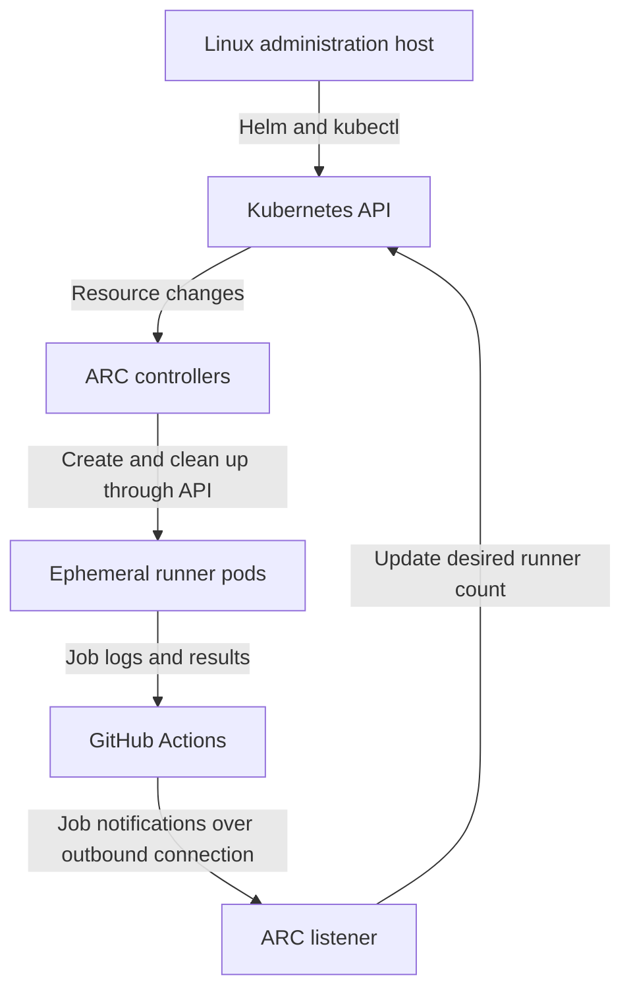

# GitHub Actions runners on Amazon EKS — Linux guide

Configure Actions Runner Controller (ARC) from a Linux Bash terminal, run ten GitHub Actions jobs on temporary EKS runner pods, and scale the runners back to zero when no jobs remain.

This is the Linux companion to the [Windows PowerShell guide](README.md). Both guides use the same cluster resources, Helm values and workflow. **If ARC is already working from the Windows setup, connect your Linux machine to that cluster and skip reinstalling the controller or recreating the Secret.**

The commands target Ubuntu/Debian or Amazon Linux 2023/RHEL-compatible administration hosts. WSL Ubuntu also works. They manage an existing EKS cluster with Linux workers; they do not create a cluster or worker nodes.

> **Lab status:** ARC chart `0.14.2` was installed and the listener was reported available. The ten-pod test is provided here, but successful test results have not been recorded. Version `0.14.2` is the observed lab version, not a claim about the newest release.

## Contents

- [Architecture](#architecture)
- [Settings and prerequisites](#settings-and-prerequisites)
- [1. Prepare Bash and AWS CLI](#1-prepare-bash-and-aws-cli)
- [2. Authenticate to AWS](#2-authenticate-to-aws)
- [3. Install a compatible kubectl](#3-install-a-compatible-kubectl)
- [4. Install Helm 3 and connect to EKS](#4-install-helm-3-and-connect-to-eks)
- [5. Create namespaces and install ARC](#5-create-namespaces-and-install-arc)
- [6. Configure GitHub authentication](#6-configure-github-authentication)
- [7. Configure and install the runner scale set](#7-configure-and-install-the-runner-scale-set)
- [8. Create and run the ten-job workflow](#8-create-and-run-the-ten-job-workflow)
- [9. Verify ten runners and scale-down to zero](#9-verify-ten-runners-and-scale-down-to-zero)
- [Troubleshooting](#troubleshooting)
- [Upload the documentation to GitHub](#upload-the-documentation-to-github)
- [Production considerations and optional cleanup](#production-considerations-and-optional-cleanup)
- [References](#references)

## Architecture



The listener opens an outbound HTTPS connection to GitHub. Job demand causes it to update `EphemeralRunnerSet.spec.replicas`. ARC controllers manage the runner resources; Kubernetes schedules the pods. Each runner executes one job, then is cleaned up. See [ARC architecture](https://docs.github.com/en/actions/concepts/runners/actions-runner-controller).

| Component | What it does | Remains when idle? |
|---|---|---|
| Controller | Reconciles ARC resources | Yes |
| Listener | Receives work notifications and requests runner capacity | Yes |
| Runner pod | Executes one workflow job | No, with minimum zero |
| EKS worker node | Hosts pods | Controlled by separate node scaling |

ARC runner scale sets use their own job-driven scaling, so no HPA is needed. The simplified target is `min(maxRunners, assigned jobs + minRunners)`. Your minimum and maximum settings remain fixed while the desired replica count changes. This is an ARC custom resource, not a standard Kubernetes ReplicaSet.

## Settings and prerequisites

| Setting | Value used here |
|---|---|
| Repository | `https://github.com/meshekar51/go-web-app-devops` |
| Controller release / namespace | `arc` / `arc-systems` |
| Runner release / namespace | `k8s-runners` / `arc-runners` |
| GitHub Secret / key | `github-auth` / `github_token` |
| Helm chart version | `0.14.2` for both charts |
| Idle runners / maximum total | `0` / `10` |
| Runner image | `ghcr.io/actions/actions-runner:latest` for this lab |

You need a repository you administer, an AWS identity allowed to access EKS, and Kubernetes permissions to install CRDs and RBAC resources. You also need ready Linux workers with enough CPU, memory and pod slots.

| Network path | Purpose |
|---|---|
| Linux host → EKS API | Cluster administration |
| Linux host → download sites and `ghcr.io` | Tools and Helm charts |
| EKS nodes → image registries | Pull container images |
| ARC pods → GitHub services over HTTPS | Registration, job delivery, logs and results |

For a private EKS endpoint, use a host inside the VPC or an approved VPN/routed connection. Private worker subnets need an appropriate NAT/proxy path to external services. No inbound ALB or Ingress is needed for ARC. Use the complete [GitHub communication requirements](https://docs.github.com/en/actions/reference/runners/self-hosted-runners#communication-requirements) when configuring restricted outbound access.

## 1. Prepare Bash and AWS CLI

Open a Bash terminal. Run sections in order and stop if a command fails. Do not run the whole guide as one script: fresh-install and existing-install instructions differ.

Install supporting tools using **one** matching package manager. Skip tools already installed.

Ubuntu/Debian:

```bash
sudo apt-get update
sudo apt-get install -y curl unzip ca-certificates tar gzip git jq less gnupg
```

Amazon Linux 2023/RHEL-compatible systems:

```bash
sudo dnf install -y unzip ca-certificates tar gzip git jq less gnupg2
command -v curl >/dev/null || sudo dnf install -y curl
```

Check AWS CLI:

```bash
aws --version
```

If a working AWS CLI v2 is already installed, keep it. Otherwise, download and inspect the official Linux installer:

```bash
mkdir -p "$HOME/arc-tool-installers"
curl -fsSL https://awscli.amazonaws.com/v2/install.sh \
  -o "$HOME/arc-tool-installers/install-aws-cli.sh"
less "$HOME/arc-tool-installers/install-aws-cli.sh"
```

Press `q` to exit the viewer, then run the inspected script:

```bash
bash "$HOME/arc-tool-installers/install-aws-cli.sh"
export PATH="$HOME/.local/bin:$PATH"
aws --version
```

AWS documents this installer for Linux x86-64 and ARM64, with a user-local installation by default. See [AWS CLI installation](https://docs.aws.amazon.com/cli/latest/userguide/getting-started-install.html). For future terminal sessions, add the PATH export once to your shell startup file if your distribution does not already include it.

Use the extracted integration folder or your repository root as the working directory. For example, after downloading and extracting the bundle:

```bash
cd "$HOME/Downloads/arc-eks-integration"
pwd
```

Change that path to your actual extraction location. If using only this README, create an empty working directory instead:

```bash
mkdir -p "$HOME/arc-eks-setup"
cd "$HOME/arc-eks-setup"
```

## 2. Authenticate to AWS

Check your current identity first:

```bash
aws sts get-caller-identity
```

If the correct identity is already available through a profile, CloudShell session or EC2 role, keep it. For company IAM Identity Center / SSO:

```bash
aws configure sso --profile arc-lab
aws sso login --profile arc-lab
export AWS_PROFILE=arc-lab
aws sts get-caller-identity
```

On a remote host without a browser, use:

```bash
aws sso login --profile arc-lab --use-device-code --no-browser
```

Follow the printed URL and code from a trusted browser. If your personal lab uses approved IAM access keys instead, run `aws configure --profile arc-lab`, set `AWS_PROFILE` as above, and verify the identity. See [AWS SSO configuration](https://docs.aws.amazon.com/cli/latest/userguide/cli-configure-sso.html).

Set the actual region and cluster:

```bash
ARC_REGION='ap-southeast-2'
read -r -p 'Enter your existing EKS cluster name: ' ARC_CLUSTER

aws eks describe-cluster \
  --region "$ARC_REGION" \
  --name "$ARC_CLUSTER" \
  --query 'cluster.{Name:name,Status:status,Version:version}' \
  --output table
```

Confirm `ACTIVE` and the intended cluster. Keep this terminal open; the shell variables are used later.

## 3. Install a compatible kubectl

If already installed, run `kubectl version --client`. EKS requires the client to be within one minor version of the cluster. Skip installation if your version is compatible. See [EKS kubeconfig requirements](https://docs.aws.amazon.com/eks/latest/userguide/create-kubeconfig.html).

For a fresh client installation, this block downloads the latest patch within your cluster's minor version, verifies its SHA-256 checksum and installs it for your user. It handles Linux x86-64 and ARM64:

```bash
(
  set -euo pipefail
  : "${ARC_REGION:?Set ARC_REGION first}"
  : "${ARC_CLUSTER:?Set ARC_CLUSTER first}"

  ARC_K8S_MINOR=$(aws eks describe-cluster \
    --region "$ARC_REGION" --name "$ARC_CLUSTER" \
    --query 'cluster.version' --output text)

  case "$(uname -m)" in
    x86_64) ARC_ARCH=amd64 ;;
    aarch64|arm64) ARC_ARCH=arm64 ;;
    *) printf 'Unsupported host architecture\n' >&2; exit 1 ;;
  esac

  ARC_KUBECTL_VERSION=$(curl -fsSL \
    "https://dl.k8s.io/release/stable-${ARC_K8S_MINOR}.txt")
  ARC_DOWNLOAD_DIR=$(mktemp -d)
  trap 'rm -rf -- "$ARC_DOWNLOAD_DIR"' EXIT

  curl -fsSL \
    "https://dl.k8s.io/release/${ARC_KUBECTL_VERSION}/bin/linux/${ARC_ARCH}/kubectl" \
    -o "$ARC_DOWNLOAD_DIR/kubectl"
  curl -fsSL \
    "https://dl.k8s.io/release/${ARC_KUBECTL_VERSION}/bin/linux/${ARC_ARCH}/kubectl.sha256" \
    -o "$ARC_DOWNLOAD_DIR/kubectl.sha256"

  cd "$ARC_DOWNLOAD_DIR"
  printf '%s  kubectl\n' "$(cat kubectl.sha256)" | sha256sum --check
  mkdir -p "$HOME/.local/bin"
  install -m 0755 kubectl "$HOME/.local/bin/kubectl"
)
```

After it succeeds:

```bash
export PATH="$HOME/.local/bin:$PATH"
hash -r
command -v kubectl
kubectl version --client
```

The parentheses run the install block in a subshell, so its temporary directory and error settings do not change your interactive shell. The download and checksum method follows the [Linux kubectl installation guide](https://kubernetes.io/docs/tasks/tools/install-kubectl-linux/).

## 4. Install Helm 3 and connect to EKS

Check Helm first:

```bash
helm version --short
```

If Helm 3 is already present, skip installation. Otherwise download and inspect the official Helm 3 installer:

```bash
mkdir -p "$HOME/arc-tool-installers"
curl -fsSL https://raw.githubusercontent.com/helm/helm/main/scripts/get-helm-3 \
  -o "$HOME/arc-tool-installers/get-helm-3"
less "$HOME/arc-tool-installers/get-helm-3"
```

Press `q`, then install into your user-local binary directory:

```bash
mkdir -p "$HOME/.local/bin"
HELM_INSTALL_DIR="$HOME/.local/bin" USE_SUDO=false \
  bash "$HOME/arc-tool-installers/get-helm-3"
export PATH="$HOME/.local/bin:$PATH"
hash -r
helm version --short
```

Confirm the output starts with `v3`. This uses the [Helm 3 installer](https://raw.githubusercontent.com/helm/helm/main/scripts/get-helm-3) for the [ARC quickstart](https://docs.github.com/en/actions/tutorials/use-actions-runner-controller/get-started).

Configure Kubernetes access:

```bash
aws eks update-kubeconfig --region "$ARC_REGION" --name "$ARC_CLUSTER"
kubectl config current-context
kubectl get nodes -L kubernetes.io/os
kubectl get pods -n kube-system
```

Confirm ready Linux workers and healthy system pods. `update-kubeconfig` writes connection details; it does not grant cluster access. Avoid `sudo kubectl`: it may use root's credentials and kubeconfig instead of yours.

Check installation permissions and existing releases:

```bash
kubectl auth can-i create customresourcedefinitions.apiextensions.k8s.io
kubectl auth can-i create clusterroles.rbac.authorization.k8s.io
kubectl auth can-i create namespaces
helm list -A
```

The permission checks should return `yes`; they are preliminary checks, not a complete audit.

## 5. Create namespaces and install ARC

If using the bundle, the namespace manifest already exists. For a standalone setup, create it:

```bash
mkdir -p k8s/arc
cat > k8s/arc/namespaces.yaml <<'EOF'
apiVersion: v1
kind: Namespace
metadata:
  name: arc-systems
---
apiVersion: v1
kind: Namespace
metadata:
  name: arc-runners
EOF
```

Set the chart variables and verify the pinned versions are available:

```bash
ARC_VERSION='0.14.2'
ARC_CONTROLLER_CHART='oci://ghcr.io/actions/actions-runner-controller-charts/gha-runner-scale-set-controller'
ARC_RUNNER_CHART='oci://ghcr.io/actions/actions-runner-controller-charts/gha-runner-scale-set'

helm show chart "$ARC_CONTROLLER_CHART" --version "$ARC_VERSION"
helm show chart "$ARC_RUNNER_CHART" --version "$ARC_VERSION"
kubectl apply -f k8s/arc/namespaces.yaml
```

Stop if either chart lookup fails. OCI charts do not require `helm repo add`.

**Fresh controller installation only:**

```bash
helm install arc "$ARC_CONTROLLER_CHART" \
  --namespace arc-systems \
  --version "$ARC_VERSION" \
  --wait --timeout 5m
```

If `arc` is already installed and healthy, skip that command and check it:

```bash
helm status arc -n arc-systems
kubectl get pods -n arc-systems
```

See the [official ARC installation sequence](https://docs.github.com/en/actions/tutorials/use-actions-runner-controller/get-started).

## 6. Configure GitHub authentication

**If your existing `github-auth` Secret works, skip token and Secret creation.** Check only its metadata:

```bash
kubectl get secret github-auth -n arc-runners
```

For a fresh installation, open [GitHub fine-grained tokens](https://github.com/settings/personal-access-tokens) in your browser:

1. Generate a token named `eks-arc-lab` with an expiry.
2. Select the repository's resource owner.
3. Select only `go-web-app-devops` under repository access.
4. Set repository **Administration → Read and write**.
5. Generate and copy the token; complete organisation approval if required.

These are the documented [repository-scoped ARC authentication permissions](https://docs.github.com/en/actions/how-tos/manage-runners/use-actions-runner-controller/authenticate-to-the-api).

Paste the entire block below into an interactive Bash terminal. It hides token entry, disables shell tracing for this subshell and submits the token through standard input without saving it to disk:

```bash
(
  set +x
  set -euo pipefail
  trap 'unset ARC_PAT' EXIT
  read -r -s -p 'Paste your GitHub token: ' ARC_PAT
  printf '\n'
  if [[ -z "$ARC_PAT" ]]; then
    printf 'Token cannot be empty\n' >&2
    exit 1
  fi

  printf '%s' "$ARC_PAT" |
    kubectl create secret generic github-auth \
      --namespace arc-runners \
      --from-file=github_token=/dev/stdin
)
```

Expected: `secret/github-auth created`. If it says `AlreadyExists`, this command did not replace the existing Secret; keep a working Secret rather than deleting it to rerun setup.

```bash
kubectl get secret github-auth -n arc-runners
```

The Secret must be in the runner namespace. Commit only its reference, never token values, exported Secrets or kubeconfig files.

## 7. Configure and install the runner scale set

The bundle contains [runner-values.yaml](k8s/arc/runner-values.yaml). Review it with:

```bash
cat k8s/arc/runner-values.yaml
```

For a new standalone lab, create this file. If it already contains custom settings, edit the existing file rather than overwriting it:

```bash
mkdir -p k8s/arc
cat > k8s/arc/runner-values.yaml <<'EOF'
githubConfigUrl: "https://github.com/meshekar51/go-web-app-devops"
githubConfigSecret: github-auth
runnerScaleSetName: k8s-runners

minRunners: 0
maxRunners: 10

template:
  spec:
    nodeSelector:
      kubernetes.io/os: linux
    containers:
      - name: runner
        image: ghcr.io/actions/actions-runner:latest
        command: ["/home/runner/run.sh"]
        resources:
          requests:
            cpu: "250m"
            memory: "512Mi"
          limits:
            cpu: "1"
            memory: "1Gi"
EOF
```

Use your actual repository URL with **no `.git` suffix**. The quoted `<<'EOF'` delimiter writes YAML literally: it does not expand shell variables. The image uses `latest` for this lab; pin a tested image for production and maintain its updates.

Ten runners request **2.5 CPU cores and 5 GiB memory** in total, plus other cluster workloads and overhead. CPU/memory limits are different from scheduling requests. Node pod limits, taints and selectors also affect whether ten runners fit.

Install or update the scale set:

```bash
helm upgrade --install k8s-runners "$ARC_RUNNER_CHART" \
  --namespace arc-runners \
  --version "$ARC_VERSION" \
  --values k8s/arc/runner-values.yaml \
  --wait --timeout 5m
```

Validate:

```bash
kubectl get autoscalingrunnersets.actions.github.com -n arc-runners
kubectl get autoscalingrunnersets.actions.github.com k8s-runners \
  -n arc-runners -o jsonpath='{.spec.githubConfigUrl}{"\n"}'
kubectl get pods -A -l app.kubernetes.io/component=runner-scale-set-listener
kubectl get pods -n arc-runners
```

Expect minimum `0`, maximum `10`, and a ready listener. Zero idle runners is normal. A missing listener is not explained by minimum zero; inspect controller logs. Helm success alone does not prove successful GitHub authentication. See [runner deployment and limits](https://docs.github.com/en/actions/how-tos/manage-runners/use-actions-runner-controller/deploy-runner-scale-sets).

## 8. Create and run the ten-job workflow

Use the supplied [.github/workflows/arc-scale-test.yml](.github/workflows/arc-scale-test.yml), or create the identical workflow below at the root of your repository. If this file already exists, compare it first.

```bash
mkdir -p .github/workflows
cat > .github/workflows/arc-scale-test.yml <<'EOF'
name: ARC - 10 Runner Scaling Test

on:
  workflow_dispatch:

permissions: {}

concurrency:
  group: arc-scale-test
  cancel-in-progress: false

jobs:
  runner-test:
    name: Runner ${{ matrix.number }}
    runs-on: k8s-runners
    timeout-minutes: 10
    strategy:
      fail-fast: false
      max-parallel: 10
      matrix:
        number: [1, 2, 3, 4, 5, 6, 7, 8, 9, 10]
    steps:
      - name: Show runner details
        shell: bash
        env:
          JOB_NUMBER: ${{ matrix.number }}
        run: |
          echo "Job number: $JOB_NUMBER"
          echo "Runner pod: $(hostname)"
          echo "Started at: $(date -u)"
          uname -a

      - name: Keep the job running for five minutes
        shell: bash
        run: |
          for minute in 1 2 3 4 5; do
            echo "Minute $minute of 5 - running on $(hostname)"
            sleep 60
          done

      - name: Finish
        shell: bash
        run: |
          echo "Test completed on $(hostname)"
          echo "Finished at: $(date -u)"
EOF
```

The quoted heredoc preserves `${{ matrix.number }}`, `$JOB_NUMBER` and `$(hostname)` so GitHub and the runner evaluate them later. Do not remove the quotes around `EOF`.

| Workflow setting | Result |
|---|---|
| Ten matrix values | Ten separate jobs |
| `max-parallel: 10` | Allows ten jobs to run concurrently |
| `runs-on: k8s-runners` | Selects the ARC scale set |
| Five-minute wait | Gives time to observe live pods |
| `permissions: {}` | Shell-only test needs no repository/API token permissions |
| Workflow concurrency group | Prevents overlapping runs of this test |

Other workflows can still use the same scale set and consume its capacity. This test does not perform a checkout, application deployment or Docker build. See [matrix jobs](https://docs.github.com/en/actions/how-tos/write-workflows/choose-what-workflows-do/run-job-variations).

Commit the workflow to the configured repository's default branch through your normal pull-request process. Alternatively, use GitHub **Add file → Create new file**, enter `.github/workflows/arc-scale-test.yml`, and paste the YAML content only, excluding the Bash commands and `EOF` lines.

Start watching in Linux:

```bash
kubectl get pods -n arc-runners -w
```

In GitHub, select **Actions → ARC - 10 Runner Scaling Test → Run workflow**, choose the default branch and confirm. Open the run to see ten jobs and expand **Show runner details** for each pod hostname.

## 9. Verify ten runners and scale-down to zero

In a second Bash terminal, restore your AWS profile and PATH if needed. Your saved kubeconfig is shared by terminals for the same Linux user. Count running pods:

```bash
(
  set -euo pipefail
  kubectl get pods -n arc-runners \
    -l 'app.kubernetes.io/component=runner,actions.github.com/scale-set-name=k8s-runners' \
    --field-selector=status.phase=Running -o json |
    jq '.items | length'
)
```

With sufficient capacity and no competing jobs, expect `10` while the test is executing. Pods do not start at precisely the same instant. If startup takes longer than the observation window, or fewer than ten fit, jobs may run in batches; that does not demonstrate ten concurrent runners.

Watch the changing desired replica count:

```bash
kubectl get ephemeralrunnersets.actions.github.com -n arc-runners \
  -o 'custom-columns=NAME:.metadata.name,DESIRED:.spec.replicas,CURRENT:.status.currentReplicas' \
  -w
```

After every job finishes, allow cleanup to complete. Use **Ctrl+C** to stop watching, then check:

```bash
kubectl get pods -n arc-runners \
  -l 'app.kubernetes.io/component=runner,actions.github.com/scale-set-name=k8s-runners'
kubectl get pods -A -l app.kubernetes.io/component=runner-scale-set-listener
kubectl get pods -n arc-systems -l app.kubernetes.io/instance=arc
```

The runner query should return no resources if there are no other jobs. Controller and listener remain ready; worker nodes are managed separately.

- [ ] Ten GitHub jobs succeeded.
- [ ] Job logs show ten distinct runner hostnames.
- [ ] Ten runner pods were observed concurrently in Running state.
- [ ] Runner pods returned to zero after cleanup.
- [ ] Controller and listener remained available.

## Troubleshooting

| Symptom | Check or fix |
|---|---|
| `.Values.githubConfigUrl is required` | Put the actual URL at the YAML top level; check for an empty value |
| Registration 404 with `.git` in API path | Remove `.git` from the repository URL and run Helm upgrade |
| 404 after fixing the URL | Verify repository existence and token access |
| Listener missing | Read controller logs; verify the Secret and deployed URL |
| `401` / `403` | Token expiry, Administration permission or organisation approval |
| Pods `Pending` | Scheduling events, CPU/memory requests, taints and pod limits |
| `ImagePullBackOff` | Node access to registry and correct image reference |
| Jobs remain queued | Scale set name, listener health, competing jobs and capacity |
| `command not found` | Tool installation and PATH in the current shell |
| `bad substitution` while writing YAML | Use a quoted `<<'EOF'` heredoc so GitHub expressions are preserved |
| Script has `\r` or `^M` errors | Save Bash scripts with LF line endings |
| EKS `Unauthorized` / `Forbidden` | AWS identity and EKS/Kubernetes access permissions |

Useful commands:

```bash
kubectl logs -n arc-systems -l app.kubernetes.io/instance=arc \
  --all-containers=true --since=5m --tail=100
kubectl get secret github-auth -n arc-runners
kubectl get autoscalingrunnersets.actions.github.com k8s-runners \
  -n arc-runners -o jsonpath='{.spec.githubConfigUrl}{"\n"}'
kubectl get events -n arc-runners --sort-by=.metadata.creationTimestamp
```

Inspect a specific pod:

```bash
read -r -p 'Pod name: ' ARC_POD
read -r -p 'Pod namespace: ' ARC_NAMESPACE
kubectl describe pod "$ARC_POD" -n "$ARC_NAMESPACE"
kubectl logs "$ARC_POD" -n "$ARC_NAMESPACE" --all-containers=true --tail=100
```

The `.git` suffix caused the registration failure observed during this integration. Correct ARC URL:

```yaml
githubConfigUrl: "https://github.com/meshekar51/go-web-app-devops"
```

After editing the values, rerun the Helm upgrade command in section 7. No controller reinstallation is needed for that values change. See [official troubleshooting](https://docs.github.com/en/actions/tutorials/use-actions-runner-controller/troubleshoot).

## Upload the documentation to GitHub

For the bundle layout, place this file alongside `README.md` as `README-LINUX.md`. All relative file links then work as supplied.

For an existing application repository, use `docs/arc-eks/README-LINUX.md` alongside the Windows guide. Adjust links beginning `k8s/arc/` to `../../k8s/arc/` and `.github/` to `../../.github/`. Commands still run from the repository root. See [UPLOAD-GUIDE.md](UPLOAD-GUIDE.md) for the complete file layout.

Add this link to your application's existing README:

```markdown
[Linux ARC setup guide](docs/arc-eks/README-LINUX.md)
```

From a clean local clone, create a branch before copying your files:

```bash
git status --short
git switch -c docs/arc-linux-guide
```

After copying the Linux guide into `docs/arc-eks/` and adding the navigation link, review and stage only those changes:

```bash
git diff
git add docs/arc-eks/README-LINUX.md README.md
git diff --cached
git commit -m 'Add Linux guide for ARC runners on EKS'
git push -u origin docs/arc-linux-guide
```

Open a pull request and merge through the normal process. If your repository uses a different documentation location, adjust those paths. Uploading documentation does not install ARC or run the test.

## Production considerations and optional cleanup

For production, use GitHub App authentication where supported, a tested pinned runner image with an update process, isolated CI capacity and central log retention. Application builds, Docker/container execution, AWS permissions and Kubernetes deployment permissions require separate configuration. See [GitHub deployment guidance](https://docs.github.com/en/actions/how-tos/manage-runners/use-actions-runner-controller/deploy-runner-scale-sets).

**Run cleanup only when intentionally removing this lab and after all jobs finish.** Keep the controller running until the scale set is removed:

```bash
helm uninstall k8s-runners -n arc-runners --wait --timeout 5m
kubectl get autoscalingrunnersets.actions.github.com -n arc-runners
kubectl get pods -n arc-runners
```

After successful removal, delete the now-unused Secret:

```bash
kubectl delete secret github-auth -n arc-runners
```

If no other scale sets use this controller:

```bash
helm uninstall arc -n arc-systems --wait --timeout 5m
```

Namespaces and CRDs may remain. Review shared dependencies before deleting them. EKS workers and the cluster are not removed by these commands; their charges can continue.

## References

Linux installation guidance checked on 1 October 2026. This document's Bash syntax is checked locally; the commands have not been executed against your AWS account or EKS cluster.

- [AWS CLI installation](https://docs.aws.amazon.com/cli/latest/userguide/getting-started-install.html)
- [AWS CLI SSO](https://docs.aws.amazon.com/cli/latest/userguide/cli-configure-sso.html)
- [EKS kubeconfig](https://docs.aws.amazon.com/eks/latest/userguide/create-kubeconfig.html)
- [Install kubectl on Linux](https://kubernetes.io/docs/tasks/tools/install-kubectl-linux/)
- [Helm 3 installer](https://raw.githubusercontent.com/helm/helm/main/scripts/get-helm-3)
- [ARC quickstart](https://docs.github.com/en/actions/tutorials/use-actions-runner-controller/get-started)
- [ARC authentication](https://docs.github.com/en/actions/how-tos/manage-runners/use-actions-runner-controller/authenticate-to-the-api)
- [Scale set configuration](https://docs.github.com/en/actions/how-tos/manage-runners/use-actions-runner-controller/deploy-runner-scale-sets)
- [Matrix jobs](https://docs.github.com/en/actions/how-tos/write-workflows/choose-what-workflows-do/run-job-variations)
